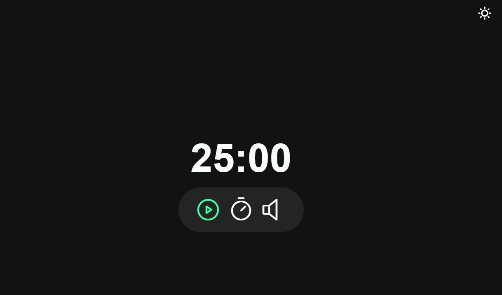

<h1 align="center"> Fotoblog </h1>

Projeto feito para demonstrar técnicas ES6 modules, estados, variáveis, callback functions e um modo escuro / claro.  

Foi explorado o conceito de estados para controlar o tempo decorrido e a contagem regressiva do timer. 

  <a href="#-tecnologias">Tecnologias</a>&nbsp;&nbsp;&nbsp;|&nbsp;&nbsp;&nbsp;
  <a href="#-projeto">Projeto</a>&nbsp;&nbsp;&nbsp;|&nbsp;&nbsp;&nbsp;
  <a href="#memo-licença">Licença</a>

 

  

## 🚀 Tecnologias

Esse projeto foi desenvolvido com as seguintes tecnologias:

- HTML e CSS
- Git e Github
- JavaScript
- Figma: 

## 💻 Projeto

O projeto foi um estudo do curso Rocket Seat visando ensinar alguns conceitos e tecnologias como as callback functions, que nos permiti executar ações específicas quando certos eventos ocorrerem, como o término do tempo ou a mudança do modo escuro para o claro.

Você pode acessar o app do projeto através do link - [Visite o projeto online](https://ramirisonoliveira.github.io/focustimer)

## ROL: Licença

Esse projeto está sob a licença ROL.

Feito by Ramirison Oliveira(https://github.com/RamirisonOliveira)